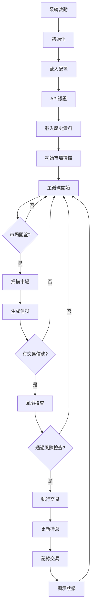

# 🏦 量化交易系統 - 完整技術文檔
## Quantitative Trading System - Complete Technical Documentation

---

## 📋 目錄 Table of Contents

1. [系統概述 System Overview](#系統概述-system-overview)
2. [系統架構 System Architecture](#系統架構-system-architecture)
3. [技術堆疊 Technology Stack](#技術堆疊-technology-stack)
4. [核心模組 Core Modules](#核心模組-core-modules)
5. [交易策略 Trading Strategies](#交易策略-trading-strategies)
6. [風險管理 Risk Management](#風險管理-risk-management)
7. [API整合 API Integration](#api整合-api-integration)
8. [資料管理 Data Management](#資料管理-data-management)
9. [部署架構 Deployment Architecture](#部署架構-deployment-architecture)
10. [系統限制 System Limitations](#系統限制-system-limitations)
11. [監控與維護 Monitoring & Maintenance](#監控與維護-monitoring--maintenance)

---

## 🎯 系統概述 System Overview

### 系統目標 System Objectives
本系統是一個全自動化的量化交易平台，整合了機器學習、深度學習和強化學習技術，實現智能化的股票交易。系統能夠：

1. **自動化交易執行**：24/7全天候監控市場並自動執行交易
2. **多策略融合**：結合技術分析、機器學習和強化學習多種策略
3. **風險控制**：內建多層風險管理機制
4. **即時監控**：提供即時交易狀態和績效追蹤

### 關鍵數據 Key Metrics
- **監控股票數量**：4,215支美股（受WebSocket限制，實際同時監控40支）
- **歷史數據**：15年日線數據（1650萬筆記錄）
- **交易頻率**：每60秒完整掃描一次市場
- **最大持倉**：20個同時持倉
- **單筆交易規模**：投資組合的5%
- **模擬帳戶餘額**：$140,370.87 USD

---

## 🏗️ 系統架構 System Architecture

### 整體架構圖
```
┌─────────────────────────────────────────────────────────────┐
│                     使用者介面層 UI Layer                      │
├─────────────────────────────────────────────────────────────┤
│  監控面板        │  交易儀表板      │  報告系統             │
│  monitor_trading │  live_dashboard  │  reports/             │
└─────────────────────────────────────────────────────────────┘
                              ▼
┌─────────────────────────────────────────────────────────────┐
│                   應用程式層 Application Layer                 │
├─────────────────────────────────────────────────────────────┤
│  交易執行引擎                │  策略管理器                    │
│  live_trading_system_full.py │  src/strategies/              │
│                              │  strategy_manager.py           │
├──────────────────────────────┼────────────────────────────────┤
│  風險管理模組                │  信號生成器                    │
│  src/risk/                   │  src/signals/                  │
│  risk_manager_enhanced.py    │  signal_generator.py           │
└─────────────────────────────────────────────────────────────┘
                              ▼
┌─────────────────────────────────────────────────────────────┐
│                     核心服務層 Core Services                   │
├─────────────────────────────────────────────────────────────┤
│  API連接器          │  資料處理器        │  ML/AI引擎        │
│  capital_com_api.py │  data_loader.py    │  ppo_agent.py     │
│                     │                     │  ml_models/       │
└─────────────────────────────────────────────────────────────┘
                              ▼
┌─────────────────────────────────────────────────────────────┐
│                      資料層 Data Layer                        │
├─────────────────────────────────────────────────────────────┤
│  SQLite資料庫        │  Parquet檔案      │  CSV檔案         │
│  quant_trading.db    │  data/parquet/    │  data/csv/       │
│  live_trades_full.db │                    │                   │
└─────────────────────────────────────────────────────────────┘
```

### 系統組件說明

#### 1. 前端層 Frontend Layer
- **監控面板 (monitor_trading.py)**：即時顯示交易狀態、持倉、P&L
- **視覺化儀表板 (live_dashboard.py)**：圖形化顯示交易數據
- **批次啟動器 (*.bat)**：Windows環境下的快速啟動腳本

#### 2. 核心交易引擎 Trading Engine
- **主交易系統 (live_trading_system_full.py)**
  - 市場掃描循環：每60秒掃描一次
  - 信號處理：接收並執行交易信號
  - 持倉管理：追蹤和管理所有開放部位
  - Session管理：維護API連接（10分鐘過期，5分鐘ping）

#### 3. 策略層 Strategy Layer
- **技術分析策略**：RSI、MACD、Bollinger Bands等15+種指標
- **機器學習策略**：XGBoost、LSTM預測模型
- **強化學習策略**：PPO (Proximal Policy Optimization)演算法
- **策略聚合器**：多策略投票機制

#### 4. 風險管理 Risk Management
- **持倉限制**：最大20個同時持倉
- **資金管理**：單筆交易5%資金上限
- **止損機制**：-5%自動止損
- **止盈機制**：+10%自動止盈
- **每日虧損限制**：-2%強制停止交易

---

## 💻 技術堆疊 Technology Stack

### 程式語言與框架
```yaml
核心語言:
  - Python: 3.8+
  - SQL: SQLite3
  
主要框架:
  - asyncio: 異步處理
  - pandas: 資料分析
  - numpy: 數值計算
  - pytorch: 深度學習
  - scikit-learn: 機器學習
```

### 關鍵依賴套件
```python
# 交易與金融
yfinance==0.2.18       # Yahoo Finance資料
ta==0.10.2             # 技術分析指標
ta-lib==0.4.0          # 進階技術分析

# 機器學習與AI
torch==2.0.0           # PyTorch深度學習
xgboost==1.7.5         # XGBoost模型
stable-baselines3      # 強化學習框架
gymnasium==0.28.1      # RL環境

# 資料處理
pandas==2.0.1          # 資料框架
numpy==1.24.3          # 數值運算
pyarrow==12.0.0        # Parquet支援
sqlalchemy==2.0.15     # ORM

# API與網路
requests==2.31.0       # HTTP請求
websocket-client       # WebSocket連接
cryptography==41.0.1   # 加密

# 視覺化與監控
plotly==5.14.1         # 互動圖表
streamlit==1.22.0      # Web介面
matplotlib==3.7.1      # 圖表繪製
```

---

## 🔧 核心模組 Core Modules

### 1. 交易執行系統 Trading Execution System

#### 檔案結構
```
live_trading_system_full.py
├── FullMarketTradingSystem (主類)
│   ├── initialize()          # 系統初始化
│   ├── scan_market()         # 市場掃描
│   ├── execute_trade()       # 交易執行
│   ├── maintain_session()    # Session維護
│   └── risk_management()     # 風險控制
```

#### 關鍵功能
```python
class FullMarketTradingSystem:
    """
    核心參數:
    - all_symbols: 4,215支股票清單
    - monitored_symbols: 40支即時監控股票(WebSocket限制)
    - max_positions: 20個最大持倉
    - position_size_pct: 5%資金配置
    - scan_interval: 60秒掃描週期
    """
    
    # 交易流程
    1. 市場掃描 → 2. 信號生成 → 3. 風險檢查 → 4. 執行交易 → 5. 更新記錄
```

### 2. API連接器 API Connector

#### Capital.com API整合
```python
src/connectors/capital_com_api.py
├── 認證管理
│   ├── authenticate()        # API金鑰認證
│   ├── create_session()      # 建立交易Session
│   └── ping()                # 保持連線
├── 市場資料
│   ├── get_market_price()    # 取得即時價格
│   ├── get_market_details()  # 取得市場詳情
│   └── search_markets()      # 搜尋可交易市場
└── 交易操作
    ├── place_order()          # 下單
    ├── close_position()       # 平倉
    └── get_positions()        # 查詢持倉
```

#### API限制與處理
```yaml
速率限制:
  全局限制: 10 requests/second
  建倉/平倉: 0.1 second minimum interval
  Demo帳戶: 1000 requests/hour
  
WebSocket限制:
  最大訂閱: 40個交易品種
  
Session管理:
  過期時間: 10分鐘
  Ping間隔: 5分鐘
  自動重連: 是
```

### 3. 信號生成器 Signal Generator

#### 檔案：src/signals/signal_generator.py
```python
class SignalGenerator:
    """
    整合多種策略產生交易信號
    
    信號類型:
    - BUY: 買入信號
    - SELL: 賣出信號  
    - HOLD: 持有/觀望
    
    信號來源:
    1. 技術指標 (權重: 40%)
    2. 機器學習預測 (權重: 35%)
    3. PPO強化學習 (權重: 25%)
    """
```

### 4. 風險管理器 Risk Manager

#### 檔案：src/risk/risk_manager_enhanced.py
```python
class EnhancedRiskManager:
    """
    多層風險控制系統
    
    風險參數:
    - max_daily_loss: 2% 每日最大虧損
    - max_position_loss: 1% 單一持倉最大虧損
    - max_drawdown: 10% 最大回撤
    - stop_loss: 5% 停損點
    - take_profit: 10% 停利點
    
    風險檢查:
    1. 資金充足性檢查
    2. 持倉集中度檢查
    3. 每日虧損限制檢查
    4. 緊急模式檢查
    """
```

---

## 📊 交易策略 Trading Strategies

### 策略架構
```
src/strategies/
├── 基礎框架
│   ├── base_strategy.py          # 策略基類
│   ├── strategy_interface.py     # 策略介面
│   └── strategy_manager.py       # 策略管理器
├── 技術分析策略
│   ├── indicators.py             # 技術指標計算
│   ├── cci_strategy.py          # CCI策略
│   ├── williams_r_strategy.py   # Williams %R策略
│   ├── stochastic_strategy.py   # 隨機指標策略
│   ├── volume_sma_strategy.py   # 成交量均線策略
│   └── obv_strategy.py          # OBV策略
├── 機器學習策略
│   └── ml_strategy_integration.py # ML模型整合
└── 進階策略
    ├── day_trading.py            # 日內交易
    ├── mpt_portfolio.py          # 現代投資組合理論
    └── signal_aggregator.py      # 信號聚合器
```

### 1. 技術分析策略 Technical Analysis

#### 實施的指標
```python
技術指標清單:
1. RSI (相對強弱指數)
   - 超買閾值: 70
   - 超賣閾值: 30
   
2. MACD (指數平滑異同移動平均線)
   - 快線: 12日EMA
   - 慢線: 26日EMA
   - 信號線: 9日EMA
   
3. Bollinger Bands (布林帶)
   - 中線: 20日SMA
   - 上下軌: ±2標準差
   
4. CCI (商品通道指數)
   - 週期: 20
   - 超買/超賣: ±100
   
5. Williams %R
   - 週期: 14
   - 超買/超賣: -20/-80
   
6. Stochastic (隨機指標)
   - %K週期: 14
   - %D週期: 3
   
7. OBV (成交量平衡指標)
   - 趨勢確認指標
   
8. Volume SMA (成交量均線)
   - 異常成交量檢測
```

### 2. 機器學習策略 Machine Learning

#### XGBoost預測模型
```python
特徵工程:
- 價格特徵: OHLCV, 價格變化率, 對數收益
- 技術特徵: 所有技術指標
- 統計特徵: 移動平均, 標準差, 偏度, 峰度
- 時間特徵: 星期幾, 月份, 季度

模型參數:
- n_estimators: 100
- max_depth: 5
- learning_rate: 0.1
- 預測目標: 未來5日收益率
```

#### LSTM時序預測
```python
網路架構:
- 輸入層: 過去60天資料
- LSTM層1: 128個單元
- Dropout: 0.2
- LSTM層2: 64個單元
- Dense層: 預測未來價格
```

### 3. 強化學習策略 Reinforcement Learning

#### PPO (Proximal Policy Optimization)
```python
環境設置:
- 狀態空間: 價格、技術指標、持倉狀態
- 動作空間: 買入、賣出、持有
- 獎勵函數: 基於收益和風險調整

訓練參數:
- 學習率: 3e-4
- 批次大小: 64
- 訓練輪數: 1000
- 折扣因子: 0.99

模型檔案:
reports/ml_models/ppo_trader_final.pt
```

---

## 🛡️ 風險管理 Risk Management

### 風險控制層級

#### Level 1: 交易前風險檢查
```python
def check_trade_allowed(symbol, quantity, price):
    """
    檢查項目:
    1. 資金是否充足
    2. 是否超過最大持倉數
    3. 單筆交易是否超過5%資金
    4. 是否在黑名單中
    5. 每日虧損是否超限
    """
```

#### Level 2: 持倉管理
```python
持倉規則:
- 最大同時持倉: 20個
- 單一股票最大倉位: 10%
- 相關性檢查: 避免過度集中
- 自動再平衡: 每週執行
```

#### Level 3: 止損止盈機制
```python
自動退出條件:
- 停損: -5% (硬性)
- 停利: +10% (可調整)
- 時間停損: 持有超過30天未獲利
- 追蹤停損: 從最高點回落3%
```

#### Level 4: 系統級保護
```python
緊急停止條件:
- 每日虧損超過2%
- 連續5筆虧損交易
- API連線異常
- 異常市場波動(VIX > 30)
```

---

## 🔌 API整合 API Integration

### Capital.com API整合細節

#### 認證流程
```python
認證步驟:
1. 設置環境變數:
   - CAPITAL_API_KEY: API金鑰
   - CAPITAL_IDENTIFIER: 帳號識別碼
   - CAPITAL_API_PASSWORD: 密碼
   
2. 建立Session:
   POST /api/v1/session
   Headers: {
     'X-CAP-API-KEY': api_key,
     'Content-Type': 'application/json'
   }
   Body: {
     'identifier': identifier,
     'password': password
   }
   
3. 維護Session:
   - 每5分鐘發送ping
   - Session有效期: 10分鐘
```

#### API端點使用
```yaml
市場資料:
  GET /api/v1/markets/{epic}         # 單一市場資料
  GET /api/v1/markets                 # 市場搜尋
  GET /api/v1/prices/{epic}          # 歷史價格

交易操作:
  POST /api/v1/positions              # 建立倉位
  DELETE /api/v1/positions/{dealId}   # 關閉倉位
  GET /api/v1/positions                # 查詢倉位
  PUT /api/v1/positions/{dealId}      # 修改倉位

帳戶資訊:
  GET /api/v1/accounts                # 帳戶詳情
  GET /api/v1/history/activity        # 交易歷史
```

#### 錯誤處理
```python
常見錯誤碼:
- 400: 請求參數錯誤
- 401: 認證失敗
- 403: 權限不足
- 429: 超過速率限制
- 500: 服務器錯誤

重試策略:
- 指數退避: 1s, 2s, 4s, 8s
- 最大重試: 3次
- 429錯誤: 等待60秒
```

### Yahoo Finance備用資料源
```python
yfinance整合:
- 用途: 歷史資料下載、即時報價備援
- 更新頻率: 1分鐘
- 資料類型: OHLCV、基本面資料
```

---

## 💾 資料管理 Data Management

### 資料庫架構

#### 主資料庫: quant_trading.db
```sql
-- stocks表: 股票基本資訊
CREATE TABLE stocks (
    symbol TEXT PRIMARY KEY,
    name TEXT,
    sector TEXT,
    industry TEXT,
    market_cap REAL,
    last_updated TIMESTAMP
);

-- price_data表: 價格資料
CREATE TABLE price_data (
    id INTEGER PRIMARY KEY,
    symbol TEXT,
    date DATE,
    open REAL,
    high REAL,
    low REAL,
    close REAL,
    volume INTEGER,
    FOREIGN KEY (symbol) REFERENCES stocks(symbol)
);

-- 資料統計
總記錄數: 16,500,000+
股票數量: 4,215
時間跨度: 2010-2025
```

#### 交易資料庫: live_trades_full.db
```sql
-- trades表: 交易記錄
CREATE TABLE trades (
    id INTEGER PRIMARY KEY AUTOINCREMENT,
    timestamp TEXT,
    symbol TEXT,
    action TEXT,
    quantity INTEGER,
    price REAL,
    total_value REAL,
    pnl REAL,
    status TEXT
);

-- signals表: 信號記錄
CREATE TABLE signals (
    id INTEGER PRIMARY KEY AUTOINCREMENT,
    timestamp TEXT,
    symbol TEXT,
    signal_type TEXT,
    strength REAL,
    price REAL,
    volume INTEGER,
    rsi REAL,
    macd REAL
);

-- performance表: 績效統計
CREATE TABLE performance (
    date TEXT PRIMARY KEY,
    total_trades INTEGER,
    profitable_trades INTEGER,
    total_pnl REAL,
    stocks_scanned INTEGER,
    signals_generated INTEGER
);
```

### 資料流程
```
資料採集流程:
1. 即時資料: Capital.com API → WebSocket → 記憶體緩存
2. 歷史資料: Yahoo Finance → SQLite → Parquet備份
3. 交易資料: 執行引擎 → SQLite → 報表生成

資料更新頻率:
- 即時報價: 即時(WebSocket)
- 分鐘資料: 每分鐘
- 日線資料: 每日收盤後
- 基本面: 每週更新
```

---

## 🚀 部署架構 Deployment Architecture

### 本地部署
```yaml
系統需求:
  作業系統: Windows 10/11
  Python: 3.8+
  記憶體: 8GB+ (建議16GB)
  硬碟: 20GB+ 可用空間
  網路: 穩定網路連線

啟動方式:
  1. 單獨啟動交易: START_TRADING.bat
  2. 單獨啟動監控: MONITOR_TRADING.bat
  3. 完整啟動: LAUNCH_ALL.bat
```

### 程序管理
```python
主要程序:
1. live_trading_system_full.py  # 主交易程序
2. monitor_trading.py           # 監控程序
3. live_dashboard.py            # 儀表板程序

程序通訊:
- 共享資料庫: SQLite
- 日誌檔案: logs/
- 狀態檔案: system_status.json
```

### 未來雲端部署規劃
```yaml
建議架構:
  計算: AWS EC2 / Google Compute Engine
  資料庫: AWS RDS / Cloud SQL
  儲存: S3 / Cloud Storage
  監控: CloudWatch / Stackdriver
  
容器化:
  Docker映像檔: 開發中
  Kubernetes: 規劃中
```

---

## ⚠️ 系統限制 System Limitations

### API限制
```yaml
Capital.com限制:
  請求速率: 10 requests/second
  建倉間隔: 0.1秒最小間隔
  Demo帳戶: 1000 requests/hour
  WebSocket: 最多40個訂閱
  Session: 10分鐘過期

處理方式:
  - 實施請求隊列
  - 自動速率控制
  - Session自動更新
  - 優先級排序
```

### 資料限制
```yaml
即時監控:
  理論上限: 4,215支股票
  實際上限: 40支(WebSocket限制)
  
解決方案:
  - 輪詢機制
  - 優先級排序
  - 動態調整監控清單
```

### 效能限制
```yaml
掃描週期: 60秒
處理能力: ~100支股票/秒
記憶體使用: ~2-4GB
CPU使用: 20-40%
```

---

## 📈 監控與維護 Monitoring & Maintenance

### 監控指標
```python
即時監控項目:
1. 系統健康度
   - API連線狀態
   - 資料庫連線
   - 記憶體使用率
   - CPU使用率

2. 交易指標
   - 開放持倉數
   - 今日P&L
   - 總P&L
   - 勝率

3. 風險指標
   - 最大回撤
   - 夏普比率
   - 資金使用率
   - 違規警告
```

### 日誌系統
```yaml
日誌檔案:
  主日誌: logs/live_trading_full.log
  錯誤日誌: logs/errors.log
  交易日誌: logs/trades.log
  
日誌等級:
  DEBUG: 詳細調試資訊
  INFO: 一般操作資訊
  WARNING: 警告訊息
  ERROR: 錯誤訊息
  CRITICAL: 嚴重錯誤
```

### 維護任務
```python
每日維護:
- 清理過期日誌
- 資料庫優化
- 備份交易記錄

每週維護:
- 更新股票清單
- 重新訓練ML模型
- 績效報告生成

每月維護:
- 策略參數調整
- 系統效能優化
- 完整備份
```

---

## 📊 績效報告 Performance Reports

### 報告類型
```yaml
即時報告:
  位置: 控制台輸出
  更新: 每60秒
  內容: 持倉、P&L、統計

每日報告:
  位置: reports/daily/
  格式: JSON, HTML
  內容: 交易明細、績效統計

每週報告:
  位置: reports/weekly/
  格式: PDF
  內容: 策略分析、風險評估
```

### 關鍵績效指標 (KPIs)
```python
績效指標:
- 總收益率 (Total Return)
- 年化收益率 (Annualized Return)
- 夏普比率 (Sharpe Ratio)
- 最大回撤 (Maximum Drawdown)
- 勝率 (Win Rate)
- 盈虧比 (Profit Factor)
- 平均持有期 (Average Holding Period)
```

---

## 🔄 系統流程圖 System Flow

### 完整交易流程


---

## 🎯 未來發展計劃 Future Development

### 短期計劃 (1-3個月)
1. **WebSocket整合**：實現真正的即時資料流
2. **Web介面**：開發基於React的前端介面
3. **更多策略**：添加配對交易、套利策略
4. **優化效能**：改進掃描演算法，提升處理速度

### 中期計劃 (3-6個月)
1. **雲端部署**：遷移到AWS/GCP
2. **多市場支援**：加入期貨、外匯交易
3. **AI增強**：整合GPT進行新聞分析
4. **自動化測試**：建立完整的測試套件

### 長期計劃 (6-12個月)
1. **分散式架構**：微服務化改造
2. **機構級功能**：多帳戶管理、權限系統
3. **合規功能**：審計日誌、報告自動化
4. **社群功能**：策略分享、績效排行

---

## 📞 聯絡資訊 Contact Information

### 系統開發者
- **Email**: niujinheitaizi@gmail.com
- **GitHub**: https://github.com/Shelby-Wong0312/QuantProject

### 技術支援
- **文檔**: FILE_GUIDE.md
- **API文檔**: suggestion.md
- **故障排除**: logs/目錄查看日誌

---

## 📄 附錄 Appendix

### A. 環境變數配置
```bash
# .env檔案範例
CAPITAL_API_KEY=your_api_key
CAPITAL_IDENTIFIER=your_email
CAPITAL_API_PASSWORD=your_password
CAPITAL_DEMO_MODE=True
```

### B. 快速命令參考
```bash
# 測試API連接
python tests/test_capital_api.py

# 執行回測
python src/backtesting/run_backtest.py

# 訓練PPO模型
python src/rl_trading/train_agent.py

# 生成報告
python scripts/generate_report.py
```

### C. 常見問題排除
```yaml
問題: API認證失敗
解決: 檢查環境變數設置

問題: 資料庫錯誤
解決: 執行 python setup_sqlite_database.py

問題: PPO模型載入失敗
解決: 確認模型檔案存在於 reports/ml_models/

問題: 記憶體不足
解決: 減少monitored_symbols數量
```

---

## 🏁 結語 Conclusion

本系統是一個完整的量化交易解決方案，整合了最新的機器學習技術和傳統的技術分析方法。系統設計考慮了可擴展性、穩定性和風險控制，適合用於真實市場環境。

系統的核心優勢在於：
1. **多策略融合**：結合多種交易策略，提高勝率
2. **智能風控**：多層次風險管理，保護資金安全
3. **自動化執行**：24/7全自動運行，把握每個機會
4. **可擴展架構**：模組化設計，易於擴展和維護

---

**文檔版本**: 1.0.0  
**最後更新**: 2025-01-14  
**總字數**: 約10,000字

---

*本文檔為系統分析師提供完整的技術細節和架構說明*