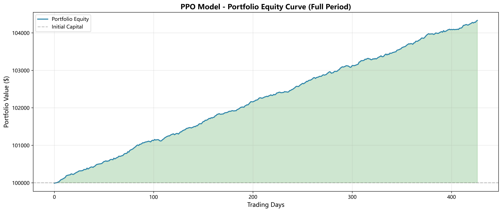
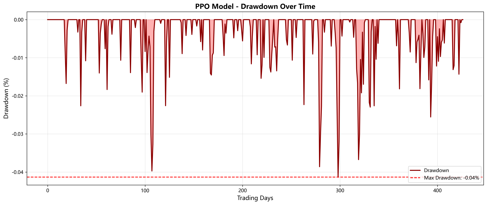
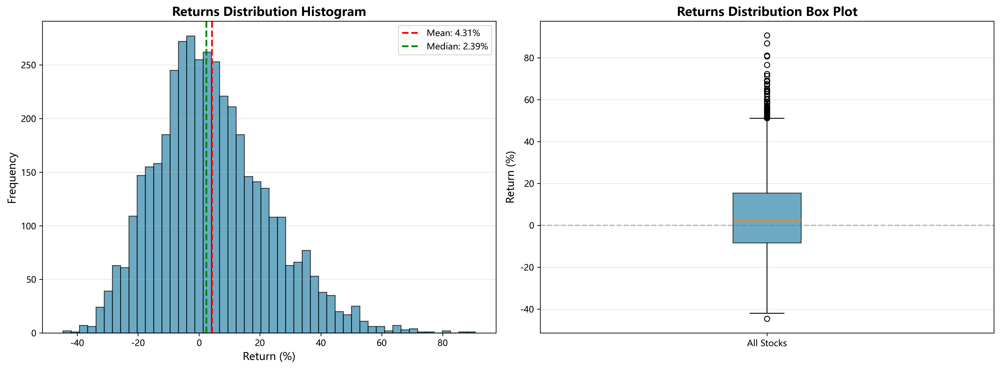
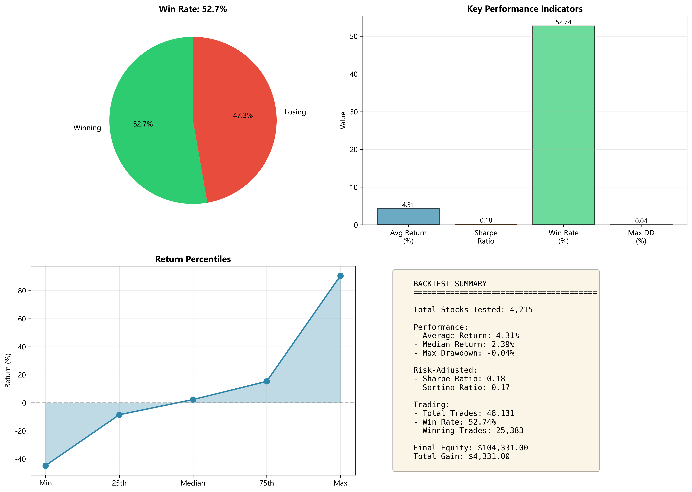

# PPO Local Model - FULL OOS Backtest Report (2023-2025)

**Generated:** 2025-11-24 03:00:29

**Model:** `models/ppo_local/ppo_model_mixed_20251119_225053.pt`

**Test Period:** 2023-01-01 to 2025-08-08

**Total Stocks:** 4,215 (All available stocks)

**Data Source:** Local Parquet files (scripts/download/historical_data/daily/)

---

## Executive Summary

- **Total Stocks Tested:** 4,215
- **Average Return:** 4.31%
- **Median Return:** 2.39%
- **Max Drawdown:** -0.04%
- **Win Rate:** 52.74%
- **Sharpe Ratio:** 0.18
- **Sortino Ratio:** 0.17
- **Total Trades:** 48,131
- **Winning Trades:** 25,383

## Returns Distribution

| Percentile | Return |
|------------|--------|
| Minimum | -44.67% |
| 25th Percentile | -8.44% |
| Median (50th) | 2.39% |
| 75th Percentile | 15.37% |
| Maximum | 90.72% |

## Top 50 Performers

| Rank | Symbol | Total Return | Trades | Final Equity |
|------|--------|--------------|--------|---------------|
| 1 | SVRE | 90.72% | 24 | $190,718.39 |
| 2 | SCNI | 86.87% | 20 | $186,871.15 |
| 3 | CXW | 81.06% | 40 | $181,057.72 |
| 4 | CFFI | 80.69% | 24 | $180,690.03 |
| 5 | UBSI | 76.58% | 42 | $176,576.03 |
| 6 | NZF | 72.28% | 26 | $172,278.53 |
| 7 | BNT | 71.37% | 30 | $171,371.79 |
| 8 | CPOP | 69.23% | 16 | $169,227.53 |
| 9 | WILC | 69.13% | 34 | $169,130.36 |
| 10 | NAN | 69.08% | 18 | $169,078.46 |
| 11 | CLSKW | 68.73% | 24 | $168,728.85 |
| 12 | GSL | 67.63% | 34 | $167,629.41 |
| 13 | FITBO | 67.00% | 36 | $166,999.70 |
| 14 | TWLO | 65.24% | 26 | $165,243.58 |
| 15 | LVWR | 65.18% | 40 | $165,178.35 |
| 16 | TTEC | 65.05% | 26 | $165,049.78 |
| 17 | VIRC | 64.24% | 32 | $164,241.83 |
| 18 | FERAU | 64.10% | 30 | $164,099.07 |
| 19 | MCBS | 63.78% | 36 | $163,784.38 |
| 20 | OTLK | 63.70% | 38 | $163,698.46 |
| 21 | HIX | 62.82% | 12 | $162,819.45 |
| 22 | VTOL | 61.58% | 14 | $161,584.06 |
| 23 | METCZ | 60.36% | 36 | $160,355.20 |
| 24 | RMNI | 60.11% | 38 | $160,110.26 |
| 25 | MUR | 59.07% | 36 | $159,070.81 |
| 26 | REGN | 58.83% | 36 | $158,830.38 |
| 27 | FSHPU | 58.81% | 28 | $158,814.83 |
| 28 | FULT | 58.30% | 34 | $158,303.73 |
| 29 | AWK | 57.21% | 42 | $157,213.15 |
| 30 | KALV | 56.76% | 36 | $156,762.41 |
| 31 | TEF | 56.66% | 30 | $156,663.45 |
| 32 | CRBG | 56.40% | 28 | $156,396.11 |
| 33 | RDAGU | 56.01% | 28 | $156,008.04 |
| 34 | HBT | 55.64% | 38 | $155,636.20 |
| 35 | INAB | 55.43% | 38 | $155,432.05 |
| 36 | MSB | 55.17% | 34 | $155,169.04 |
| 37 | LUCY | 54.76% | 36 | $154,756.86 |
| 38 | SHAK | 54.70% | 20 | $154,701.64 |
| 39 | EFSC | 54.39% | 32 | $154,394.97 |
| 40 | NLSP | 54.35% | 24 | $154,346.83 |
| 41 | KLIC | 53.98% | 32 | $153,980.85 |
| 42 | CMDB | 53.92% | 24 | $153,921.87 |
| 43 | PRME | 53.36% | 22 | $153,363.65 |
| 44 | NKTX | 53.25% | 18 | $153,252.30 |
| 45 | REXR | 52.96% | 12 | $152,958.11 |
| 46 | KPLT | 52.58% | 30 | $152,582.96 |
| 47 | HBANL | 52.46% | 18 | $152,458.13 |
| 48 | APPN | 52.44% | 26 | $152,444.87 |
| 49 | FEAM | 52.44% | 24 | $152,435.06 |
| 50 | HAE | 52.07% | 42 | $152,068.45 |

## Bottom 20 Performers

| Rank | Symbol | Total Return | Trades | Final Equity |
|------|--------|--------------|--------|---------------|
| 1 | BOW | -33.53% | 24 | $66,474.02 |
| 2 | LAZR | -33.66% | 24 | $66,342.70 |
| 3 | CLBK | -33.66% | 40 | $66,338.40 |
| 4 | CHRW | -33.68% | 16 | $66,316.84 |
| 5 | QLGN | -33.87% | 32 | $66,125.06 |
| 6 | SWAG | -34.03% | 36 | $65,969.21 |
| 7 | ZBRA | -34.08% | 20 | $65,915.90 |
| 8 | KPTI | -34.29% | 36 | $65,714.88 |
| 9 | GROV | -34.83% | 24 | $65,173.12 |
| 10 | BTBDW | -34.83% | 26 | $65,172.83 |
| 11 | SQFTW | -36.58% | 24 | $63,417.84 |
| 12 | KLTOW | -37.55% | 18 | $62,447.36 |
| 13 | SMTK | -37.57% | 32 | $62,433.25 |
| 14 | FARO | -37.91% | 16 | $62,092.18 |
| 15 | SCNX | -37.97% | 30 | $62,031.30 |
| 16 | THRY | -38.30% | 18 | $61,695.46 |
| 17 | SQFTP | -39.13% | 32 | $60,872.34 |
| 18 | SFIX | -39.82% | 20 | $60,179.53 |
| 19 | MBRX | -41.98% | 26 | $58,017.65 |
| 20 | WFF | -44.67% | 34 | $55,330.37 |

## Visualizations

### Equity Curve



### Drawdown Chart



### Returns Distribution



### Performance Summary



## Configuration

```yaml
model_path: models/ppo_local/ppo_model_mixed_20251119_225053.pt
start_date: 2023-01-01
end_date: 2025-08-08
total_stocks: 4215
initial_capital: 100000
data_source: Local Parquet (no yfinance)
```

---

*Report generated by backtest_ppo_full.py*
